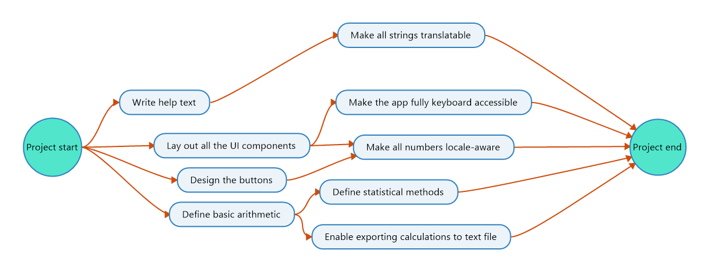
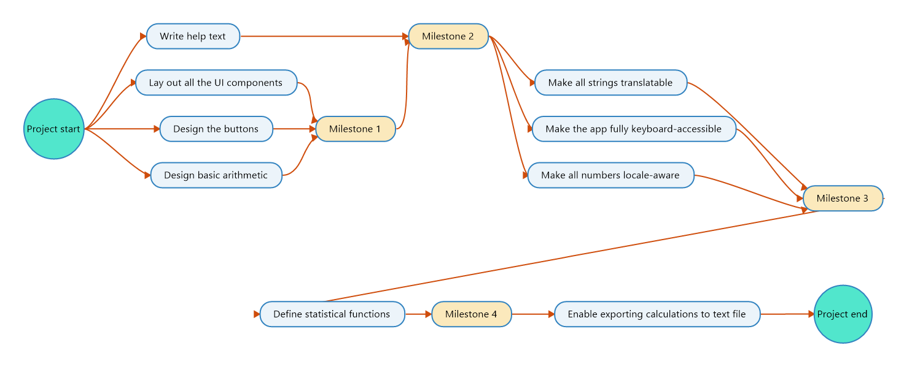

# Olivertwistor Project Model
This is my project model that I'm using with all my programming projects. It includes both instructions and templates.

* [Installation][1]
* [Usage](#usage)
* [Licenses](#licenses)
* [Project instructions](#project-instructions)
    * [Create a new repository](#create-a-new-repository)
    * [Add basic documentation][5]
    * [Create a work breakdown structure](#create-a-work-breakdown-structure)
    * [Create a network diagram](#create-a-network-diagram)
    * [Add milestones](#add-milestones)
        * [Milestones in GitHub](#milestones-in-github)
    * [Create GitHub issues][6]
    * [Work on issues](#work-on-issues)
        * [Branching](#branching)
        * [Testing](#testing)
        * [Documentation][7]
        * [Closing an issue](#closing-an-issue)
    * [Create a release](#create-a-release)
        * [Build the project][8]

## Installation
You can either read all the documents in this repository [online on Github](https://github.com/olivertwistor/olivertwistor-project-model) or [download them for offline use](https://github.com/olivertwistor/olivertwistor-project-model/releases).

## Usage
Follow the section [Installation][1]. If you're using this model as a template for your own projects, feel free to skip any steps that doesn't fit your particular project.

## Licenses
The files in this repository are licensed under a [Creative Commons Attribution 4.0 International](https://creativecommons.org/licenses/by/4.0/) license. For detailed license terms, please read [LICENSE](LICENSE).

## Project instructions
In this section, I will describe the steps to take for a project, from start to finish. Try to follow each step in the order they are written, but don't be afraid to go back to previous steps if you need to add or change something. After all, software development is an iterative and incremental process.

### Create a new repository

These instructions presume that you already have a Github account and are logged in.

1. Go to https://github.com/new
1. Choose a *Repository name*.
1. Write a short *Description* of what the project is about.
1. Choose between making the repository *Public* or *Private*. Public repositories are to be preferred since making it open source gives back to the community. For client work and the like, choose *Private*.
1. Press the button *Create repository*.

### Add basic documentation

The repository should have the following repository documentation, placed in the root of the repository:

* `README.md` ([template](templates/template-readme.md "README.md template"))
* `LICENSE` ([template](templates/template-license.md "LICENSE template"))
* `CONTRIBUTING.md` ([template](templates/template-contributing.md "CONTRIBUTING.md template"))
* `CHANGELOG.md` ([template](templates/template-changelog.md "CHANGELOG.md license"))

### Create a work breakdown structure

In a work breakdown structure (WBS), the goal is to capture the totality of tasks needed for the project to be completed. This can be difficult to do, especially in software development where there are so many unknowns in the beginning. Don't worry that you might not capture all tasks in one go. Just try to capture as many tasks as possible; you can always return to this step later.

It's a good idea to store the WBS as a mind map or a nested list. That way you can have multiple levels of granularity over your tasks, in order to have better overview of all tasks. Neither the order of the tasks nor their priority are important (you will deal with that at later steps). Try to make each task a manageable size, like four to eight hours. If it would be larger, it's probably more suitable to be a work package (closer to the middle in the mind map).

This image shows a (partial) WBS of a calculator app. Note that only the outermost nodes in the map are considered to be tasks. All other are work packages &mdash; groups of tasks that are connected in some way. 

The tasks in this example are:

* Design the buttons
* Lay out all the UI components
* Write help text
* Make all strings translatable
* Make all numbers locale-aware
* Make the app fully keyboard accessible
* Define basic arithmetic
* Define statistical functions
* Enable exporting calculations to text file.

The same WBS presented in a nested list would look like this:

1. Create the UI
    1. Design the buttons.
    1. Lay out all the UI components.
    1. Write help text.
    1. Do localization.
        1. Make all strings translatable.
        1. Make all numbers locale-aware.
    1. Make the app fully keyboard accessible.
1. Define the mathematical operations.
    1. Define basic arithmetic.
    1. Define statistical functions.
1. Enable exporting calculations to text file.

In my example, the task *Enable exporting calculations to text file* could probably be broken down further and thus would be more suited as a work package. While working with your project, you will undoubtedly discover things like this. When it happens, you can go back back to this step and add to the WBS.

Check in the work breakdown structure file(s) into version control under the folder `project-files`. The file name(s) should begin with `wbs-`.

### Create a network diagram

With the work breakdown structure in place, it's now time to create a network diagram. This is the step where you define an order to all tasks, as well their dependency relationships. Some tasks may be quite independent and could be worked on whenever and in parallel with other tasks, but most tasks are dependent on the completion of other tasks or have themselves dependent tasks.

A network diagram can either be created as a mind map or a table. I'll show an example of a mind map first. I'll use the same calculator app example as in the previous section.

The same network diagram presented in a table would look like this:

| ID    | Name                                       | Depends upon              |
| ----- | ------------------------------------------ | ------------------------- |
|       | *Project start*                            |                           |
| 1.1   | Design the buttons.                        |                           |
| 1.2   | Lay out all the UI components.             |                           |
| 1.3   | Write help text.                           |                           |
| 1.4.1 | Make all strings translatable.             | 1.3                       |
| 1.4.2 | Make all numbers locale-aware.             | 1.1, 1.2                  |
| 1.5   | Make the app fully keyboard accessible.    | 1.2                       |
| 2.1   | Define basic arithmetic.                   |                           |
| 2.2   | Define statistical functions.              | 2.1                       |
| 3     | Enable exporting calculation to text file. | 2.1                       |
|       | *Project end*                              | 1.4.1, 1.4.2, 1.5, 2.2, 3 |

Note that the ID's correspond to the tasks in the nested list from the previous section. Also, note that I added a *Project start* and a *Project end*. Obviously, a work breakdown structure and network diagram is much more detailed than this in a real-life project.

As you can see, it's possible to have both one-to-many dependencies and many-to-one dependencies. For example, when you're finished with task 1.2, you may proceed with task 1.5, but not task 1.4.2 before you're also finished with task 1.1. Unfortunately, GitHub doesn't provide a way to express these kinds of relationships. Apart from managing a network diagram yourself, the only thing that GitHub can help with regarding this is milestones. We will discuss those in the next section.

Check in the network diagram file(s) into version control under the folder `project-files`. The file name(s) should begin with `network-`.

### Add milestones

Milestones are points during the development when you have something that is deliverable, for example when a feature is implemented. Think of milestones as the big steps you need to take in order to finish the project, and tasks as the small steps leading up to each milestone. You should start with the network diagram and insert milestones at appropriate places. For example:

Note that to increase readability in the image, *Milestone 3* leads to a task to its southwest. Milestones are coloured yellow and tasks coloured light blue. The same diagram can be presented as a table, as follows:

| ID     | Name                                        | Depends upon        |
| ------ | ------------------------------------------- | ------------------- |
|        | *Project start*                             |                     |
| 1.1    | Design the buttons.                         |                     |
| 1.2    | Lay out all the UI components.              |                     |
| 2.1    | Design basic arithmetic.                    |                     |
| *MS 1* | *Milestone 1*                               | *1.1, 1.2, 2.1*     |
| 1.3    | Write help text.                            |                     |
| *MS 2* | *Milestone 2*                               | *1.3*               |
| 1.4.1  | Make all strings translatable.              | 1.3                 |
| 1.4.2  | Make all numbers locale-aware.              | 1.1, 1.2            |
| 1.5    | Make the app fully keyboard accessible.     | 1.2                 |
| *MS 3* | *Milestone 3*                               | *1.4.1, 1.4.2, 1.5* |
| 2.2    | Define statistical functions                | 2.1                 |
| *MS 4* | Milestone 4                                 | 2.2                 |
| 3      | Enable exporting calculations to text file. | 2.1                 |
|        | *Project end*                               |                     |

In this example with the calculator app, we have defined four milestones (if we don't include the project end). This means that we can deliver five consecutive versions of the app. The first version with the ability to do basic arithemetic, and with the buttons and UI elements laid out. The second version have a help text. The third version includes accessibility enhancements. The fourth version adds statistical functions to the calculator. The fifth and final version enables the user to export their calculations to a text file. By doing things this way, the users can quickly begin using your app, already after three of the nine tasks in total.

In which order you decide to do tasks and milestones depends on how you prioritize functionality. That the first milestone in my example should come first is probably not controversial &mdash; it's pointless to do anything else before laying the foundation for the app to even be operable. However, milestones 2 through 4 can be debated. Is accessibility more important than a help text? Is providing statistical functions and export capabilities more important than accessibility? It depends on your user base. If your user base comprises of statisticians who speak the same language as you, and are capable of using a mouse, then it would make much more sense to move *Milestone 3* to before *Milestone 2* (and leave everything else unchanged). Please note that we couldn't have switched places of *Milestone 1* and *Milestone 2*, because task 1.4.1 in *Milestone 2* depends on task 1.3 in *Milestone 1*.

#### Milestones in GitHub

Milestones can be found at the GitHub repo URL appended with `/milestones`, for example [Olivertwistor Project Model's milestones](https://github.com/olivertwistor/olivertwistor-project-model/milestones). They can also be created directly from the issue detail's page. 

Each milestone represents a release, and should contain all issues that need to be resolved for that release. Since milestones represent releases, they should share names and follow [Semantic Versioning 2.0.0](https://semver.org/). The naming pattern is described next.

Semantic Versioning dictates that version numbers follow a specific pattern: `MAJOR.MINOR.FIX`. A *3.1.4* version number means that it's the third major release of this project, the second minor release within that major release (the first `MINOR` is always a zero), and the fifth fix within that minor release (the first `FIX` is always a zero). You may use the following list to determine whether a particular milestone constitutes a `MAJOR`, `MINOR` or `FIX` version.

* Applications
    * Major releases mean big changes or additions in functionality, resulting in brand new ways of using the application.
    * Minor releases mean smaller changes or additions in functionality, for example that the user can save a file in PDF format in addition to TXT, as was the case previously.
    * Fixes mean bug fixes or other very small things that don't involve a change in functionality. This can be things both visible and invisible to the user, for example a fixed typo or a colour change to improve readability. Note that security bug fixes should result in a new major release (if really serious) or at least a minor release. This will tell the user that it's probably best to upgrade.
* Libraries

    * Major releases mean breaking changes in your public API, for example a removed method or a changed return type of a method. For a user of your library, to upgrade to a new major release typically has to involve changes to client code.
    
    * Minor releases mean non-breaking changes, for example added classes and methods. For a user of your library, to upgrade to a new minor release should never require changes to client code.
    
    * Fixes mean bug fixes, other changes to your private API or internal changes to methods that don't affect the public API. Note that security bug fixes should result in a new major release (if really serious) or at least a minor release. This will tell the user that it's probably best to upgrade.
    

For example, you could give the milestones of the calculator app the following version numbers.

| Milestone   | Version number | Reasoning                                                    |
| ----------- | -------------- | ------------------------------------------------------------ |
| MS 1        | 1.0.0          | It's the first release of a functioning application.         |
| MS 2        | 1.0.1          | It could be argued that added help text constitutes a `MINOR` release, and that the version number should have been 1.1.0, but I don't think of help text, tooltips etc. as added *functionality*. Perhaps I would reconsider if the help text were considerable, perhaps with full-fledged downloadable examples, but with this kind of application, the help text would be rather limited. |
| MS 3        | 1.0.2          | Again, it could be argued that added accessibility and localization constitutes a `MINOR` release. It really comes down to a judgement call. |
| MS 4        | 2.0.0          | I think that adding statistical functions is more than a `MINOR` release because of added functionality. When going from a standard calculator to providing statistical functions, it becomes almost an entirely new application. The main reason for this being a `MAJOR` release instead of a `MINOR` one is that I would think that the user base changes (or at least expands). |
| Project end | 2.1.0          | A new functionality has been added: exports.                 |

As you can see, deciding on version numbers can be tricky, and it's more of an art than a science. The most important thing is consistency, though. Version numbering is more important for libraries than for application, because library users need to know which upgrades can be done more or less automatically, and which upgrades need changes in their own applications or libraries.

### Create GitHub issues

Now it's time to create issues based on the network diagram. For each task in the diagram, do the following.

1. On the repository front page, press the *Issues* tab.
1. Press the *New issue* button.
1. Write a short but descriptive *Title*. Example: `Make all strings translatable`.
1. If you want to write more than just that short description, feel free to write it in the *Leave a comment* text box. Here you can write implementation details if you want, or perhaps argue for why this issue was created.
1. Assign a user by pressing the cogwheel besides *Assignee*. This can be altered later, so if you're not sure about to whom to assign this issue, it's better to leave it empty for now.
1. Press the cogwheel besides *Labels* and choose all labels that apply.
1. Leave *Project* empty. In this model, I'm not using GitHub projects, but if you do, feel free to select an appropriate value here.
1. Select the appropriate *Milestone* from the network diagram.
1. Press the *Submit new issue* button.

### Work on issues

Whenever you are ready to work on an issue, take a look at the closest milestone that's still open. In there, pick an issue that either is assigned to you or is yet unassigned. Please take care to not choose an issue which is dependent upon one or more open issues (see the network diagram). If that's the case, you should work on those issues first. Also, if your chosen issue is unassigned, go assigned it to yourself (as described in the previous section, [Create GitHub issues][6].

#### Branching

All my projects follow the same branching model, [Vincent Driessen's branching model][2]. To learn more about the basics of Git branches, I refer you to the [Git website][3].

The basics of the branching model is that released code is on the `master` branch, tested but not released code on `develop` and each issue on its own `feature/` or `hotfix/` branch. Releases are on a `release/` branch until they are fully released.

Let's say you have decided to work on the issue *Make all strings translatable* (task 1.4.1 in the network diagram). You have assigned yourself to the issue and are about to start working. The first thing you should do is to create a new feature branch. That should include the GitHub issue number, a shortened version of the issue name, and if you're not the only developer, your initials or something else identifying that it is *your* branch. Examples (assume that task 1.4.1 has GitHub issue number 5, and I my initials are "jn"):

* `5-translatable-strings`; or
* `5-translatable-strings-jn`

It's strictly not necessary to include the shortened version of the issue name for uniqueness' sake, but I find it easier to remember what the branch is about than just having the issue number (and the initials).

While working on your issue, commit often so each commit won't have too many code changes. That way, it will be easy for you and others to see what's done and if something went wrong, where. Don't be afraid to push your changes to the remote repository, either. That way, other contributors and even visitors to your project's GitHub page can see your progress.

#### Testing

Testing is a good thing. It should be done wherever and whenever feasible. I'm not very strict about it, though. Sergey Kolodiy have written an excellent [article about unit testing][4].

Each project should detail the testing frameworks in use, in their respective `README.md` file. Test code should be committed to the Git repository so other contributors can benefit from it.

#### Documentation

Documentation is very important, both for your own sake and for your fellow contributors. When working with others or when I'm reviewing other people's code, I often find myself having to closely study the code due to lack of documentation. Ideally, you should be able to get a grasp of what a class or interface, a method or function, or a chunk of code does by only looking at the documentation instead of having to delve into the code.

On top of documenting the code, there is need for documentation outside of the code as well. Please refer to the section [Add basic documentation][5] for templates for that.

#### Closing an issue

When you are done working with an issue, it's time to close it on GitHub. But before you do that, follow this checklist:

1. Make sure that every test passes, and that your code hasn't broken anything else in the code.
1. Update `CHANGELOG.md` with the changes you've made to the project with this issue.
1. If applicable, update `README.md` with more information about installation and usage. Remember to update the license information as well, if you have made use of a new library for this issue.
1. Commit and push the feature branch one final time.
1. Try to merge your feature branch with the `develop` branch.
1. If there are no merge conflicts, proceed to the next step. Otherwise, read on:
    1. Resolve all merge conflicts. If you're unsure of whose code is correct, yours or that of the contributor who last pushed to `develop`, contact them to discuss before going further.
    1. Make sure that every test passes, again, and that your merge hasn't broken anything else in the code.
    1. Commit and push the `develop` branch.
1. Close the GitHub issue. You may write a comment about it if you want, but that's not mandatory. Usually I write "Done." or something similar to denote that I haven't just closed the issue for another reason, for example if the issue is no longer applicable.

### Create a release

When all issues within a milestone is closed, it's time to create a new release. Follow these steps:

1. From the `develop` branch, create a new release branch named after the milestone, for example `releases/1.0.2`.
1. Make sure that every test passes.
1. Make sure that `CHANGELOG.md` and `README.md` properly reflect the state of the project.
1. Make sure that the code doesn't lack [documentation][7].
1. [Make builds of the project][8] and commit any changes to the build instructions. Normally, no generated files should be committed to version control.
1. x

#### Build the project

x

[1]: #installation
[2]: https://nvie.com/posts/a-successful-git-branching-model/
[3]: https://git-scm.com/
[4]: https://www.toptal.com/qa/how-to-write-testable-code-and-why-it-matters
[5]: #add-basic-documentation
[6]: #create-github-issues
[7]: #documentation
[8]: #build-the-project